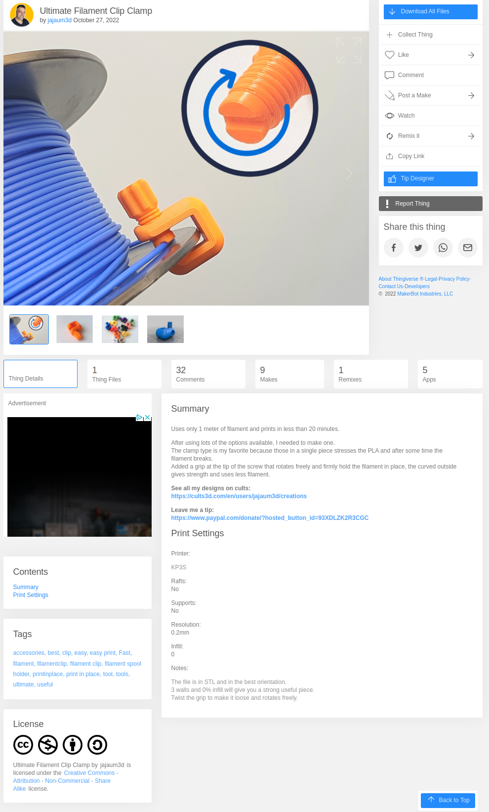
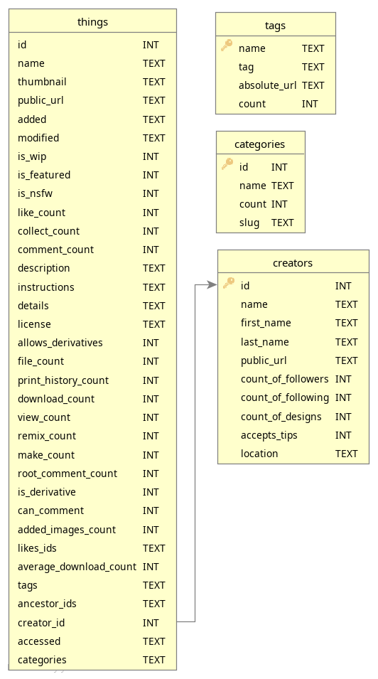
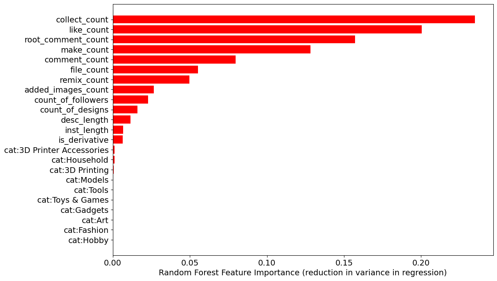
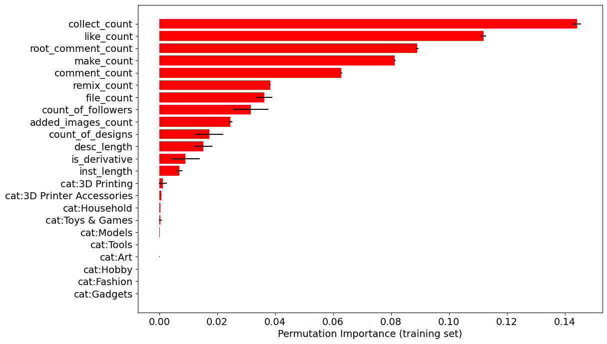

<div align="center">

# ThingiStat

### Leveraging the Thingiverse API to learn what features inform the popularity of 3D models.
</div>

<hr>


## Background

Hobbiest 3D printing has exploded in popularity over the past decade. Printers are becoming more affordable, and as adoption increases, so does the sharing of 3D models that were designed with FDM printing in mind. One of the largest repositories for 3D models is https://thingiverse.com, boasting 5 million + models available to the public that have been shared by its users.

## Objective

As a 3D printing enthusiast, I was curious to understand what makes certain model files so popular on Thingiverse. I often come across models that I think are incredibly well designed and useful, but are seldom downloaded compared to their more popular alternatives.
To explore why this is so, let's look at how a model is presented to users on Thingiverse:



<br/>
<br/>
This page is not unlike a social media or blog post. Model files are provided alongside pictures, a description, and a section for comments. The content of all of these page sections can vary significantly between similar model posts. A variety of buttons also exist, including "Download All Files", "Collect Thing", "Tip Designer" etc.
While Thingiverse algorithms can influence visibility and therefore model popularity (measured by download count), they have been known to be poor, so to simplify my analysis I neglect their effects.
If this is a bad assumption, and download activity is dominated by their algorithms, then this is an opportunity to learn what features of models Thingiverse algorithms look for to promote.

<br/>
<br/>
So, what can we learn about the steps users can take to improve the popularity of their models? And what are the actions of users on Thingiverse that correlate with them downloading a model?

## Enter ThingiStat

ThingiStat is a package that interacts with the Thingiverse API, enabling you to download metadata surrounding these model posts and store this data in a convenient SQLite databse structure that can be used as a starting point for a variety of data science projects. The included database snapshot includes the metadata of ~150k model posts (randomly sampled), and can be added to by users.

The data<sup>*</sup> that ThingiStat captures is shown in the follow schema:


<br/>

<sup>*</sup> more information on these named features can be found at https://www.thingiverse.com/developers/rest-api-reference.

### Installation (including downloading the current database snapshot)

- Clone the repo:
```console
git-lfs clone https://github.com/javathejhut/ThingiStat
cd ThingiStat
```

- Install tqdm if necessary (progress bar during downloads):
```console
pip install tqdm
```

- Install SQLite3 if necessary (should be bundled with recent Python):
```console
pip install sqlite3
```

- Install Numpy:
```console
pip install numpy
```

- Install Pandas:
```console
pip install pandas
```

- Enable API access (optional, if you wish to add to the database file that is provided):
  - Create an account on https://thingiverse.com.
  - Visit https://www.thingiverse.com/apps/create to create and register a "Desktop" app. This provides you with an app client_id, client_secret, and app_token.
  - Visit https://www.thingiverse.com/developers/getting-started and follow the API authentication steps. This will provide you with an API access_token.
  - Paste all key, value pairs of client_id, client_secret, app_token, and access_token into an auth.json (which you need to create) in the ThingiStat/ directory.
    Your auth.json file should look like:
    ```console
    {
    "client_id": "xxxxxxxxxxxx",
    "client_secret": "xxxxxxxxxxxxxx",
    "app_token": "xxxxxxxxxxxxxxxx",
    "access_token": "xxxxxxxxxxxxx"
    }
    ```

  - For more REST API documentation, visit https://www.thingiverse.com/developers/rest-api-reference to learn what queries ThingiStat is performing.

### 1. Downloading model metadata

Once you have API authentication following the above section and have created your auth.json file in the root directory, simply run:

```console
cd src/
python3 downloader.py
```

This will continue to download metadata and add it to the existing database. Note that the download order is random (not sequential in ThingID, which is the primary key for the thing API).

### 2. Interacting with the database for analysis

To load the current DB instance in Python code, do:

```python
sys.path.append('../')
from src.db_structure import DB_DIR
from src.db_utils import ThingDB

# create instance of ThingDB
db_filename = os.path.join(DB_DIR, "default_thingistat.db")
thing_db = ThingDB(db_filename)

# get all of the tables in the schema as a Pandas dataframe
things_df = thing_db.get_table("things")
categories_df = thing_db.get_table("categories")
tags_df = thing_db.get_table("tags")
creators_df = thing_db.get_table("creators")
```

More examples of database interaction and visualization are shown in the Jupyter notebook in notebooks/.

## Insights from a preliminary analysis

In an initial exploration, I trained a Random Forest Regressor on a subset of thing and creator features to predict the  download_count of models. The total dataset at this stage consists of the metadata of ~150,000 3D models .R<sup>2</sup> values for the train/test were 0.757/0.762 following a hyperparameter grid search optimizing R<sup>2</sup> in cross-validation of the training set (the full EDA and model construction can be found in /notebooks/EDA_feature_engineering_importance.ipynb).

Given this model of download counts, what features are most important, or most predictive with respect to download count?

### Feature importance via average reduction in variance (default sklearn implementation for regressor)

To first explore feature importance, I consider the average reduction in variance per feature split when creating decision trees within the random forest. This is the default feature importance in sklearn's RandomForestRegressor implementation. One downside of this approach is that high cardinality features (eg. high variance numerical ones) could be uniquely mapped to download counts, meaning that reduction in variance would be highly biased towards these features over low cardinality ones:



### Feature importance via permutation importance

An alternative measurement of feature importance, and one that addresses the potential bias of variance feature importance, is permutation importance. This is computed by applying the model to a test/train set as usual to generate a reference test score. Then for a specific column in the dataset (column is a feature), this column is randomly shuffled with another column and the test score is computed again. By comparing the referEnce test score with the average permuted score over a defined number of iterations, this yields the permutation importance score:



### Takeaways

Interestingly, we see congruence in the feature importance order for the highest importance features between these two approaches. When it comes to actionable changes for users to increase model popularity, there are a few suggestions: **1) Increase the number of individual files for download (i.e. modifications to the same model for slightly different applications/dimensions)**, **(2) Increase the number of added images of prints of the models (pictures of finished prints)**, and **(3) Increase verbosity in the model description and/or printing instructions**. The rest of the features, while interesting, could be a result of high download counts and aren't properties of the post themselves (direction of causation is unclear). Nevertheless, I describe all of the features shown in these figures below as some are quite interesting:

<details closed>
<summary>
<b>collect_count:</b></big>
</summary>

This is a count of the number of times someone clicks "Collect Thing" on the model page. Interestingly, a click of this button brings you to a page that allows you to add the thing to a default collection called "make this". It also presents users at the top of this collection page with the same "download all" button. Perhaps the position of this alternate download button, or storing objects in collections, do actually increase the probability the model is eventually downloaded.

</details>

<details closed>
<summary>
<b>like_count:</b></big>
</summary>

This is a count of the number of times someone clicks the heart icon on a model. Once clicked, the thing is stored in your "liked" models collection.

</details>

<details closed>
<summary>
<b>root_comment_count:</b></big>
</summary>

This is a count of the number of comments the poster of the object makes in the comments section. Maybe poster interaction influences downloads. Or perhaps in response to downloads, more posters interact with users.

</details>

<details closed>
<summary>
<b>make_count:</b></big>
</summary>

This is a count of the number of models that were actually printed, and reference this initial model. For a model to be printed it has to be downloaded, so a connection here isn't too surprising.

</details>

<details closed>
<summary>
<b>comment_count:</b></big>
</summary>

This is a count of the number of total comments in the discusion section.

</details>

<details closed>
<summary>
<b>remix_count:</b></big>
</summary>

The number of models that reference the current model and applied modifications or "remixed" it.

</details>

</details>

<details closed>
<summary>
<b>file_count:</b></big>
</summary>

The number of 3D model files uploaded. This number will be larger for multi-part models or models that include variations for a variety of applications.

</details>

<details closed>
<summary>
<b>count_of_followers:</b></big>
</summary>

The number of followers a user has. When you follow a user, you are notified of their 3D model postings.

</details>

<details closed>
<summary>
<b>added_images_count:</b></big>
</summary>

The number of added images to the post. For each model file, a preview image is generated and can be added to the page. Furthermore, additional pictures can be added. Some examples might included when the model has been printed, painted, and in its designed application.

</details>

<details closed>
<summary>
<b>count_of_designs:</b></big>
</summary>

The number of designs a user has posted to Thingiverse.

</details>

<details closed>
<summary>
<b>desc_length:</b></big>
</summary>

The length of a model description in characters.

</details>

<details closed>
<summary>
<b>is_dervative:</b></big>
</summary>

A binary flag indicating whether or not this model was derived from another.

</details>

<details closed>
<summary>
<b>inst_length:</b></big>
</summary>

The length of printing instructions in characters.

</details>

</details>

<details closed>
<summary>
<b>cat:x</b></big>
</summary>

The model was assigned to category x when uploaded. There are 80 fixed category options provided by Thingiverse.

</details>
